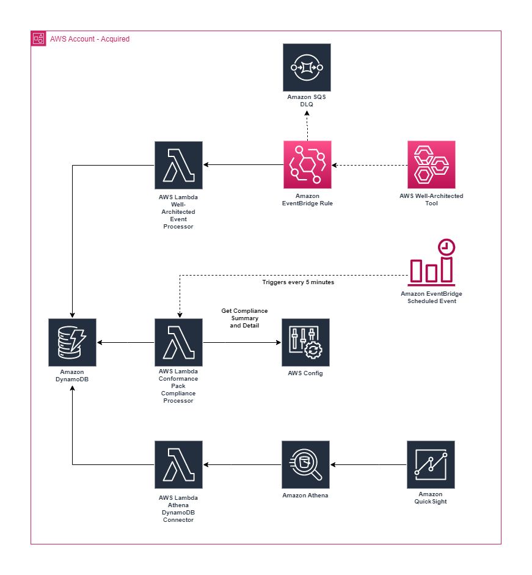

# Welcome to Mergers & Acquisitions Integration Accelerator (MAIA) Dashboard CDK Project.

## Solution Overview

Mergers & Acquisitions (M&A) often involve migrating or moving AWS accounts in to an existing organization.
Typically during the M&A Integration phase, time is wasted due to inefficient communication and application of control objectives and technical requirements, as well as inaccurate and stale risk and compliance assessments.
This solution provides **Prescriptive Guidance** on control remediation steps as well as improves **M&A Integration Oversight** via a dashboard, with near real time risk and compliance status updates, based on detective controls and information gathered via questionnaires.

[An example M&A Playbook](./resources/playbooks/AWS-S3-Playbook-01 - Block Public Access for Amazon S3 at account level.pdf) that provides remediation steps using AWS Console, AWS CLI, Terraform, and CloudFormation is provided for demonstration purposes.

### Architecture

## Pre-Requisites

To get started, you will need an AWS account, preferably free from any production workloads. We recommend using [AWS Cloud9](#aws-cloud9) to build, deploy, and configure the solution.

Before you can build and deploy the [AWS Cloud Development Kit (CDK)](https://aws.amazon.com/cdk/) project, you must perform [CDK bootstrapping](#aws-cdk-bootstrap).

This solution requires [AWS Config](#aws-config), [Amazon QuickSight](#amazon-quicksight), and [AWS Well-Architected Tool](https://aws.amazon.com/well-architected-tool/). Ensure you have proper [AWS IAM](https://aws.amazon.com/iam/) permissions to access and configure the aforementioned services.

### AWS Cloud9

[AWS Cloud9](https://aws.amazon.com/cloud9/) is a cloud-based integrated development environment (IDE) that lets you write, run, and debug your code with just a browser. Cloud9 comes pre-configured with all the required dependencies, such as git, npm, and AWS CDK.

[Create a Cloud9 environment](https://docs.aws.amazon.com/cloud9/latest/user-guide/tutorial-create-environment.html) from the AWS console. Provide the required Name, and leave the remaining default values. Once your Cloud9 environment has been created, you should be able to open and have access to a terminal window.

### AWS CDK Bootstrap

[CDK Bootstrapping](https://docs.aws.amazon.com/cdk/v2/guide/bootstrapping.html) is the process of provisioning resources for AWS CDK before you can deploy AWS CDK apps into an AWS environment. (An AWS environment is a combination of an AWS account and Region). These resources include an Amazon S3 bucket for storing files and IAM roles that grant permissions needed to perform deployments.

The required resources are defined in an AWS CloudFormation stack, called the bootstrap stack, which is usually named *CDKToolkit*. Like any AWS CloudFormation stack, it appears in the AWS CloudFormation console once it has been deployed.

If bootstrapping for the current AWS Environment (AWS Account and Region), then issue the following.

<pre><code>cdk bootstrap</code></pre>

If boostrapping for a different or multiple AWS Environments, then issue the following command after substituting the account number(s) and region(s).

<pre><code>cdk bootstrap aws://<i>ACCOUNT-NUMBER-1</i>/<i>REGION-1</i> aws://<i>ACCOUNT-NUMBER-2</i>/<i>REGION-2</i> ...</code></pre>

### AWS Config

[AWS Config](https://aws.amazon.com/config/) uses AWS Identity and Access Management (IAM) [service-linked roles](https://docs.aws.amazon.com/config/latest/developerguide/using-service-linked-roles.html). A service-linked role is a unique type of IAM role that is linked directly to AWS Config. Service-linked roles are predefined by AWS Config and include all the permissions that the service requires to call other AWS services on your behalf. You must create a Service Linked Role for AWS Config, if it does not already exist. To create a service-linked role for AWS Config, issue the following command.

<pre><code>aws iam create-service-linked-role --aws-service-name config.amazonaws.com</code></pre>

### Amazon QuickSight

You must have a [QuickSight Standard or Enterprise Subscription](https://docs.aws.amazon.com/quicksight/latest/user/signing-up.html) before deploying, and support for QuickSight-managed users must be enabled.

This CDK project uses the context variable <code>quicksight-user</code> when setting permissions for QuickSight resources created by this project, and this context variable must be set to a valid [QuickSight User ARN](https://docs.aws.amazon.com/quicksight/latest/APIReference/qs-resource-arns.html). To list QuickSight users, issue the following command:

<pre><code>aws quicksight list-users --aws-account-id <i>aws-account-id</i> --namespace default</pre></code>

If you receive the following error, set the <code>--region</code> argument to the value returned for your QuickSight Identity region.

<code>An error occurred (AccessDeniedException) when calling the ListUsers operation: Operation is being called from endpoint <i><aws region 1></i>, but your identity region is <i><aws region 2></i>. Please use the <i><aws region 2></i> endpoint.</code>

<pre><code>aws quicksight list-users --aws-account-id <i>aws-account-id</i> --namespace default --region <i>aws-region</i></pre></code>

Refer to the following instructions to [set the context variable](https://docs.aws.amazon.com/cdk/v2/guide/get_context_var.html) to the <code>quicksight-user-arn</code>. 

**IMPORTANT**: To eliminate the need to pass the context variable <code>quicksight-user</code> to <code>cdk deploy --context quicksight-user=<em>quicksight-user-arn</em></code> you can update [cdk.json](./cdk.json) by setting the <code>quicksight-user</code> value.

## Build and Deploy

From a terminal window, you will need to clone the GitHub repo, install packages, build, and deploy the AWS CDK project. 

Issue the following commands in a terminal window in Cloud9. 
By default, AWS CDK will prompt you to deploy changes. 
If you want to skip confirmations, add the following command line option to the AWS CDK <code>deploy</code> command below.  <code>--require-approval never</code>. 

<pre><code>git clone https://github.com/aws-samples/mergers-and-acquisitions-integration-accelerator
cd mergers-and-acquisitions-integration-accelerator/dashboard
# Install packages
npm install
# Build
npm run build
# Upgrade AWS CDK CLI
npm install -g aws-cdk@latest
# Bootstrap AWS Cloud Development Kit (AWS CDK)
cdk bootstrap
# Deploy Stack
cdk deploy --context quicksight-user=<i>username</i></code></pre>

## Configuration and Testing

There are 3 steps that need to be performed manually after the CDK project is deployed. These steps include loading Config Rule Playbook mappings, defining a workload in the AWS Well-Architected Tool, and deploy a Conformance Pack in AWS Config.

First, create a mapping between AWS Config Rules and Playbooks. A [spreadsheet](./resources/config-rule-playbook-mapping/ConfigRulePlaybookMapping.xlsx) is part of this project and includes the mappings, as well as a [Python script](./resources/config-rule-playbook-mapping/load-config-rule-playbook-mapping.py) to process the spreadsheet and populate a DynamoDB table.

Issue the following commands in a terminal window in Cloud9 to load the AWS Config Rule to Playbook mapping. The default value for the <code>region</code> argument is <i>us-east-1</i>. If executing from the default region, you can remove the <code>--region</code> argument.

<pre><code>cd resources/config-rule-playbook-mapping/
pip install -r requirements.txt
python load-config-rule-playbook-mapping.py --region <i>us-east-1</i></code></pre>

Next, [define a workload in the AWS Well-Architected Tool](https://docs.aws.amazon.com/wellarchitected/latest/userguide/define-workload.html) with the default AWS Well-Architected Framework Lens. After defining a workload, you can start the [workload review](https://docs.aws.amazon.com/wellarchitected/latest/userguide/tutorial-step2.html). For testing purposes, simply answer at least one question to cause the Well-Architected Tool to emit an event that will be processed and update the database.

Lastly, [setup up AWS Config](https://docs.aws.amazon.com/config/latest/developerguide/gs-console.html), and [deploy a Conformance Pack](https://docs.aws.amazon.com/config/latest/developerguide/conformance-pack-console.html). For testing, you can deploy at least one of the [Sample Conformance Pack Templates](https://docs.aws.amazon.com/config/latest/developerguide/conformancepack-sample-templates.html).

When testing and troubleshooting, be aware that the solution processes AWS Config compliance information every 5 minutes, and the Well-Architected Tool answers and risks are processed in near real time as responses are submitted in the tool, so you many have to wait a few minutes after you have performed these steps before the QuickSight Dashboard updates. Also, the QuickSight dashboard will update if you hit refresh or tab between the views.

## Troubleshooting

If you receive the following message when deploying the CDK Project, it is most likely related to the <code>quicksight-user</code> context variable.
Review the [Amazon QuickSight](#amazon-quicksight) section for instructions related to setting the context variable.

<code>Resource handler returned message: "Invalid request provided: One or more principals in resource permissions list are not valid QuickSight users (Service: QuickSight, Status Code: 400, Request ID: null)"</code>

## Cleanup

Run the following command to delete the resources created by this CDK project.

<pre><code>cdk destroy</code></pre>

Be aware that certain AWS resources aren’t deleted by the AWS CDK <code>destroy</code> command. We intentionally set the removal policy for the DynamoDB tables to retain and enabled deletion protection, as well as set the removal policy for the AWS KMS key to retain.

To delete the Amazon DynamoDB tables, refer to [disable deletion protection](https://repost.aws/questions/QU2o4hJ6ZFQ0qFzlHgAS5DXg/how-to-disable-deletion-protection) and [Deleting Amazon DynamoDB tables](https://docs.aws.amazon.com/solutions/latest/research-service-workbench-on-aws/deleting-the-amazon-dynamodb-tables.html) for more information.

To delete the AWS KMS key, refer to [deleting AWS KMS keys](https://docs.aws.amazon.com/kms/latest/developerguide/deleting-keys.html) for more information.

Lastly, [delete your Cloud9 environment](https://docs.aws.amazon.com/cloud9/latest/user-guide/delete-environment.html) if you no longer need it.

## License Summary

This library is licensed under the MIT-0 License. See the [LICENSE](./LICENSE) file.